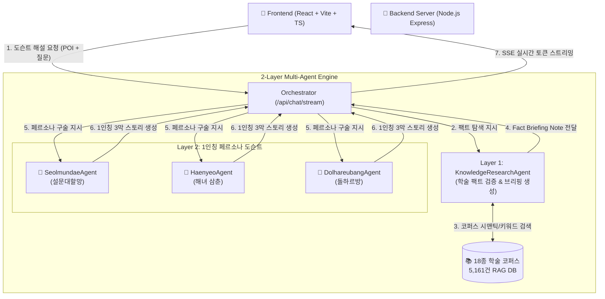

# 🏝️ 내 손안의 도슨트 (Docent-in-hand)
> **"맛집 웨이팅 3분, 제주 1인칭 신화·역사 캐릭터와 함께 떠나는 초개인화 AI 도슨트"**

[](https://ai.google.dev/)
[](https://reactjs.org/)
[](https://www.typescriptlang.org/)
[](https://vitejs.dev/)
[](https://nodejs.org/)
[](https://python.org/)

---

## 📖 프로젝트 소개 (Overview)

**내 손안의 도슨트(Docent-in-hand)**는 제주 여행 중 발생하는 짧은 유휴 시간(식당 웨이팅 3분, 카페 대기 시간 등)을 지루한 기다림에서 **'몰입형 제주 문화 탐험'**으로 전환해 주는 **Zero-Click 1인칭 AI 도슨트 서비스**입니다.

한국학중앙연구원 *한국향토문화전자대전* **18종 전 분야 공인 데이터(총 5,161건)**와 **2-Layer 백엔드 멀티 에이전트 시스템**을 결합하여, 단순 검색이나 딱딱한 백과사전식 정보가 아닌 **제주 3대 신화·역사 캐릭터의 1인칭 구술 스토리**로 들려줍니다.

---

## 🌟 핵심 기능 (Key Features)

### 1. 🤖 2-Layer 백엔드 멀티 에이전트 아키텍처
* **Layer 1: 학술 지식 탐색 연구원 (`KnowledgeResearchAgent`)**
  * 18종 5,161건의 향토문화전자대전 공인 코퍼스에서 지리·역사·민속 팩트를 정밀 검색하고 객관적 브리핑 노트를 생성합니다.
* **Layer 2: 1인칭 도슨트 페르소나 에이전트 (`PersonaAgents`)**
  * 연구원이 전달한 팩트를 기반으로 캐릭터 고유의 말투와 세계관을 100% 녹여내어 생동감 넘치는 3막 구술 스토리(도입-전개-체감)로 해설합니다.
* **⚡ SSE(Server-Sent Events) 실시간 스트리밍**
  * 에이전트의 사고 단계(`지식 브리핑 작성 중 ➔ 1인칭 스토리 구술 중`)와 생성 토큰을 실시간으로 사용자에게 스트리밍합니다.

### 2. 🎭 제주 3대 1인칭 페르소나 도슨트
| 캐릭터 | 페르소나 & 역할 | 특화 스토리 영역 | 대표 명소 |
|:---|:---|:---|:---|
| **👵 설문대할망** | 제주의 어머니이자 창세 거신 (포근한 할망 구술체) | 오름, 화산, 분화구, 폭포, 창세 전설 | 성산일출봉, 산방산, 천지연폭포, 백록담 |
| **🤿 해녀 삼춘** | 거친 바다를 일군 제주 잠녀 (씩씩하고 정겨운 삼춘 구술체) | 해안, 포구, 물질, 어로 민속, 공동체 이야기 | 도두동 무지개해안도로, 조천포구, 비양도 |
| **🗿 돌하르방** | 제주의 수호신이자 탐라 어르신 (중후하고 해학적인 어르신 구술체) | 읍성, 관아, 유적, 인물사, 항쟁사 | 제주목관아, 관덕정, 삼성혈, 삼사석 |

### 3. 🏛️ 한국학중앙연구원 18종 공인 데이터셋 & 원문 출처 연동
* **9대 공식 분야 전수 수록 (총 5,161건)**:
  * `자연과 지리`, `역사`, `문화유산`, `성씨와 인물`, `정치·경제·사회`, `종교`, `생활과 민속`, `문화와 교육`, `언어와 문학`
* **📸 3,591개 인터랙티브 POI & 실사 아카이브 사진**: 공인 멀티미디어 사진 및 슬라이드쇼 제공
* **🔗 공식 아카이브 원문 열람 버튼**: 클릭 한 번으로 한국향토문화전자대전 공식 웹페이지 원문 바로가기 지원

### 4. 📍 Zero-Click 위치 기반 자동 도슨트 & GPS 시뮬레이터
* **원클릭 제주 랜드마크 순간이동**: 성산일출봉, 용두암, 관덕정 등 주요 랜드마크로 즉시 이동하여 자동 배정된 도슨트 청취 가능
* **사용자 정의 좌표 설정**: 원하는 위도/경도를 직접 입력하여 현장 모의 테스트 지원

### 5. 🎞️ 고화질 사진 자동 슬라이드쇼 & 모션 보간
* 6초 주기 자동 전환 및 마우스 오버 시 스마트 일시정지
* 1.25초 부드러운 감속 큐빅 보간 이징 (`cubic-bezier(0.16, 1, 0.3, 1)`)
* 다중 이미지 네비게이션 및 도트 인디케이터

---

## 🏗️ 시스템 아키텍처 (System Architecture)



---

## 🛠️ 시작하기 (Getting Started)

### 사전 요구 사항
- **Node.js** (v18.0.0 이상 권장)
- **npm** (v9.0.0 이상 권장)
- **Python** (v3.9 이상 권장 - 데이터 동기화 파이프라인용)
- **Google Gemini API Key** ([Google AI Studio](https://aistudio.google.com/)에서 발급)

---

### 1. 프로젝트 복제 및 의존성 설치
```bash
# 저장소 복제
git clone https://github.com/Gukui0516/Docent-in-hand.git
cd Docent-in-hand

# 프론트엔드 및 백엔드 의존성 일괄 설치
npm run install:all
```

---

### 2. 환경변수 설정
루트 디렉토리에 `.env` 파일을 생성하고 발급받은 Gemini API 키를 입력합니다.
```env
# Google Gemini API Key
VITE_GEMINI_API_KEY=your_gemini_api_key_here
GEMINI_API_KEY=your_gemini_api_key_here

# Gemini Model (기본값: gemini-3.7-flash)
VITE_GEMINI_MODEL=gemini-3.7-flash
PORT=3001
```

---

### 3. 데이터 동기화 (Data Pipeline)
`data/` 폴더에 제주시/서귀포시 JSON 데이터가 위치하면, 아래 명령어를 통해 앱과 백엔드에 즉시 동기화됩니다.
```bash
npm run sync:data
```
*(참고: `npm run dev` 및 `npm run build` 실행 시 `predev`/`prebuild` 훅에 의해 자동으로 동기화 스크립트가 실행됩니다.)*

---

### 4. 개발 서버 실행
백엔드 멀티 에이전트 서버(포트 3001)와 프론트엔드 Vite 서버(포트 5173)를 동시에 구동합니다.
```bash
npm run dev
```
실행 후 브라우저에서 `http://localhost:5173`으로 접속합니다.

---

### 5. 프로덕션 빌드
```bash
npm run build
```

---

## 📂 디렉토리 구조 (Project Structure)

```text
Docent-in-hand/
├── data/                         # [Git 제외] 18종 원본 JSON 아카이브 데이터셋
│   ├── Jeju-si/                  # 제주시 9개 분야 데이터
│   └── Seogwipo-si/              # 서귀포시 9개 분야 데이터
├── scripts/
│   └── sync_data_to_app.py       # 자동화 데이터 정제 및 동기화 파이프라인
├── server/                       # 백엔드 멀티 에이전트 시스템
│   ├── src/
│   │   ├── agents/
│   │   │   ├── researchAgent.ts  # Layer 1 지식 탐색 연구원 에이전트
│   │   │   ├── orchestrator.ts   # 멀티 에이전트 오케스트레이터 & SSE 스트리머
│   │   │   └── personaAgents/    # Layer 2 3대 페르소나 도슨트 에이전트
│   │   │       ├── seolmundaeAgent.ts
│   │   │       ├── haenyeoAgent.ts
│   │   │       └── dolhareubangAgent.ts
│   │   └── index.ts              # Express API 서버 진입점
│   └── package.json
├── src/                          # 프론트엔드 React 애플리케이션
│   ├── components/               # UI 컴포넌트 (PhotoCard, StoryCard, POICarousel 등)
│   ├── services/                 # Agent 클라이언트 및 Gemini 서비스
│   ├── types/                    # TypeScript 인터페이스 정의
│   ├── App.tsx                   # 메인 뷰포트
│   └── index.css / App.css       # 반응형 스타일시트
├── public/                       # 정적 리소스 및 캐릭터 이미지 에셋
├── GEMINI.md                     # 프로젝트 개발 및 협업 가이드라인
└── package.json                  # 통합 실행 및 빌드 스크립트
```

---

## 📜 라이선스 및 데이터 출처 (Attribution)
* **문화재 및 향토 데이터 출처**: 한국학중앙연구원 *한국향토문화전자대전* ([https://jeju.grandculture.net/](https://jeju.grandculture.net/))
* **방언 데이터 참고**: 카카오브레인 제주어 방언 데이터셋 (JIT)
* **라이선스**: 본 프로젝트는 교육 및 해커톤 연구 목적으로 제작되었습니다.
