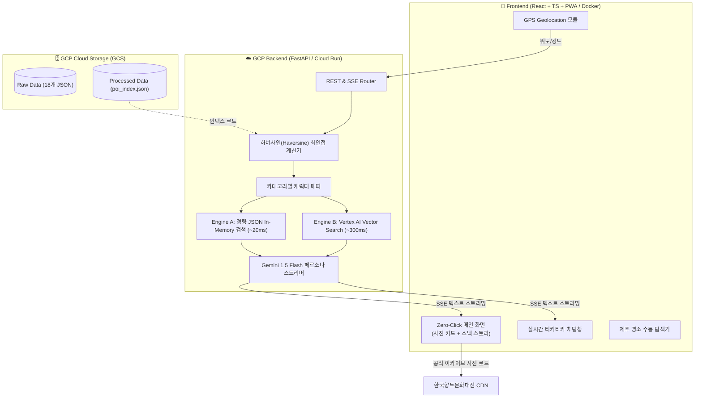

# **[기능 명세서] 내 손안의 도슨트 (Docent in hand)**

> **"맛집 대기 시간 3분, 1인칭 신화 캐릭터와 나누는 생생한 제주 이야기!"**  
> Google Cloud / Vertex AI 기반 제주 신화·자연 인터랙티브 AI 페르소나 도슨트 (모바일 웹/PWA)

---

## 📑 목차
1. [문서 개요 (Overview)](#1-문서-개요-overview)
2. [전체 시스템 구성도](#2-전체-시스템-구성도)
3. [핵심 기능 상세 명세 (Functional Requirements)](#3-핵심-기능-상세-명세-functional-requirements)
   - [FR-01: GPS 지오로케이션 및 최인접 POI 자동 매핑](#fr-01-gps-지오로케이션-및-최인접-poi-자동-매핑)
   - [FR-02: 장소별 전담 페르소나 캐릭터 자동 배정](#fr-02-장소별-전담-페르소나-캐릭터-자동-배정)
   - [FR-03: 공식 아카이브 고화질 현장 사진 카드 렌더링](#fr-03-공식-아카이브-고화질-현장-사진-카드-렌더링)
   - [FR-04: Zero-Click 1인칭 스낵 스토리 즉시 렌더링](#fr-04-zero-click-1인칭-스낵-스토리-즉시-렌더링)
   - [FR-05: 실시간 1인칭 Q&A 티키타카 대화 엔진](#fr-05-실시간-1인칭-qa-티키타카-대화-엔진)
   - [FR-06: 검색 엔진 A/B 실시간 성능 벤치마크](#fr-06-검색-엔진-ab-실시간-성능-벤치마크)
   - [FR-07: 제주 명소 탐색 및 수동 전환 모드 (Fallback)](#fr-07-제주-명소-탐색-및-수동-전환-모드-fallback)
4. [백엔드 API 규격서 (API Specification)](#4-백엔드-api-규격서-api-specification)
5. [데이터 스키마 및 가공 파이프라인 (Data Architecture)](#5-데이터-스키마-및-가공-파이프라인-data-architecture)
6. [비기능 요구사항 및 배포 환경 (Non-Functional Requirements)](#6-비기능-요구사항-및-배포-환경-non-functional-requirements)

---

## 1. 문서 개요 (Overview)

### 1.1 목적
본 문서는 해커톤 출품작 **‘내 손안의 도슨트’**의 모바일 반응형 웹 및 백엔드 시스템 구현을 위한 기능별 세부 명세와 데이터 흐름, API 규격을 정의합니다.

### 1.2 핵심 설계 원칙
- **Zero-Click 즉시 몰입:** 사용자의 조작 단계를 최소화하여 웹 접속 즉시 [위치 감지 ➔ 명소 매핑 ➔ 캐릭터 배정 ➔ 스토리 노출]이 단번에 진행됨.
- **100% 팩트 그라운딩:** 한국학중앙연구원 한국향토문화전자대전(5,161건) 및 공식 사진(3,582건) 기반 사실 왜곡 방지.
- **초저지연(Low-Latency):** 3~5분의 짧은 맛집 대기 시간을 겨냥하여 1초 이내 첫 화면 렌더링 및 실시간 AI 스트리밍 응답 제공.

---

## 2. 전체 시스템 구성도



---

## 3. 핵심 기능 상세 명세 (Functional Requirements)

### FR-01: GPS 지오로케이션 및 최인접 POI 자동 매핑
- **기능 설명:** 접속 시 브라우저 Geolocation API를 호출하여 사용자 좌표를 획득하고, 데이터셋 내 가장 가까운 명소를 매칭함.
- **입력:** 사용자 현재 위도(`latitude`), 경도(`longitude`), 정확도(`accuracy`)
- **처리 로직:**
  1. `navigator.geolocation.getCurrentPosition` 호출.
  2. 하버사인 공식(Haversine formula)으로 5,161건(또는 주요 100대 POI)과의 직선거리 $d$ 계산:
     $$d = 2R \cdot \arcsin\left(\sqrt{\sin^2\left(\frac{\Delta \text{lat}}{2}\right) + \cos(\text{lat}_1)\cos(\text{lat}_2)\sin^2\left(\frac{\Delta \text{lng}}{2}\right)}\right)$$
  3. 반경 1km 이내 가장 가까운 POI를 타깃 명소로 자동 확정.
  4. 1km 이내 명소가 없을 경우(육지 접속 등): 제주 대표 랜드마크(성산일출봉)를 기본값으로 지정하고 사용자에게 "현재 위치와 가까운 제주 명소" 알림 제공.
- **예외 처리:** 위치 권한 거부(PERMISSION_DENIED) 또는 타임아웃 발생 시 [FR-07: 수동 전환 모드]로 즉시 Fallback.

---

### FR-02: 장소별 전담 페르소나 캐릭터 자동 배정
- **기능 설명:** 사용자가 캐릭터를 고를 필요 없이, 매핑된 POI의 카테고리에 맞춰 전담 도슨트 페르소나를 시스템이 자동 지정함.
- **배정 규칙 테이블:**

| 페르소나 캐릭터 | 상징 아이콘 | 매핑 데이터 카테고리 | 대표 매핑 관광지 예시 | 페르소나 어투 톤앤매너 |
| :--- | :---: | :--- | :--- | :--- |
| **설문대할망** | 👵 | `[자연과 지리]`, `[구비전승/설화]` | 성산일출봉, 산방산, 한라산 백록담, 만장굴, 용두암 | 호탕하고 웅장한 제주 창조 여신체 (~수다, 내가 흙을 치마로 날라~) |
| **해녀 삼춘** | 🤿 | `[생활과 민속]`, `[구비전승/노동요]` | 김녕·협재 해변, 성산 바당, 서귀포 해녀탈의장, 포구 | 정 많고 억척스러운 로컬 해녀 어투 (~마씸, 숨비소리, 바당 물결) |
| **돌하르방** | 🗿 | `[문화유산]`, `[역사]`, `[성씨/인물]` | 제주목관아, 삼양동 선사유적, 관덕정, 정의현성 | 과묵하지만 든든하고 묵직한 수호 파수꾼체 (~몸이우다, 오랜 역사) |

---

### FR-03: 공식 아카이브 고화질 현장 사진 카드 렌더링
- **기능 설명:** 매핑된 POI의 한국향토문화전자대전 공식 아카이브 사진을 화면 최상단에 고화질 카드로 노출.
- **데이터 소스:** `images[0].origin_url` (또는 `middle_url`)
- **표시 항목:**
  1. 실제 명소 현장 사진 (고해상도 반응형 이미지)
  2. 명소 국문 명칭 및 영문/한자 병기
  3. 행정구역 태그 (예: `제주특별자치도 서귀포시 성산읍`)
  4. 정식 저작권 출처 표기: `출처: 한국학중앙연구원 한국향토문화전자대전`
- **폴백(Fallback):** 사진이 없는 비주류 항목일 경우, 상위 카테고리 대표 테마 이미지 자동 대체.

---

### FR-04: Zero-Click 1인칭 스낵 스토리 즉시 렌더링
- **기능 설명:** 사용자가 버튼을 클릭하지 않아도 접속과 동시에 30초 내 완독 가능한 1인칭 구술 스토리가 타이핑 애니메이션으로 자동 시작됨.
- **스토리 생성 정책:**
  - **분량:** 공백 포함 **250자 ~ 350자** 엄격 준수.
  - **3단 전개 구조:**
    1. **[도입]** 반가운 인사 + 해당 장소와 자신의 연관성 언급
    2. **[절정]** 장소의 생성 비화 또는 핵심 신화 스토리 텔링
    3. **[유도]** 관광객의 호기심을 자극하는 마무리 질문 (티키타카 트리거)
  - **방언 비율:** 20~30% (외지인이 이해하기 쉬운 종결어미 및 호칭 위주, 필요 시 괄호 풀이).
- **출력 방식:** SSE(Server-Sent Events) 스트리밍을 통한 타자기(Typewriter) 효과.

---

### FR-05: 실시간 1인칭 Q&A 티키타카 대화 엔진
- **기능 설명:** 초기 스낵 스토리 이후, 사용자가 해당 명소 및 신화에 대해 추가 질문을 입력하면 캐릭터 페르소나를 유지한 채 실시간 대화.
- **인터랙션 구성 요소:**
  1. **추천 질문 칩 (Quick Question Chips):** 관광객이 자주 묻는 질문 2~3개 자동 생성 (예: *"할망, 우도를 빨래돌로 쓰면 안 거칠었어요?"*, *"숨비소리가 뭐예요?"*)
  2. **자유 텍스트 입력창:** 모바일 키보드 최적화 인풋 및 음성 마이크 아이콘(UI 지원).
- **대화 맥락(Context) 유지:** 최근 3~5턴의 `role: user`, `role: model` 히스토리를 서버로 전달하여 일관된 맥락 유지.
- **왜곡 방지 가드레일:** 허위 사실이나 억지 질문 유입 시, 캐릭터 어투로 유쾌하게 정정 (Grounding 검증).

---

### FR-06: 검색 엔진 A/B 실시간 성능 벤치마크
- **기능 설명:** 두 가지 데이터 검색 파이프라인(Engine A vs Engine B)의 성능과 응답 속도를 측정·비교할 수 있는 관리자/데모 토글 제공.

| 항목 | **Engine A (경량 JSON In-Memory / Index)** | **Engine B (Vertex Vector Search / 임베딩)** |
| :--- | :--- | :--- |
| **동작 방식** | `poi_index.json` 사전 메모리 적재 후 위경도/키워드 Direct 매칭 | 텍스트 임베딩 모델(text-embedding-004)로 코사인 유사도 벡터 탐색 |
| **목표 지연시간** | **10ms ~ 30ms** | **250ms ~ 500ms** |
| **측정 메트릭** | 1) 검색 소요 시간(Query Latency, ms)<br/>2) 첫 토큰 생성 시간(TTFT, ms)<br/>3) 전체 스트리밍 완료 시간(Total Latency, ms) |
| **UI 노출** | 우측 상단 벤치마크 뱃지 (실시간 경과 시간 ms 표시) |

---

### FR-07: 제주 명소 탐색 및 수동 전환 모드 (Fallback)
- **기능 설명:** GPS 미허용 사용자나 제주 외 지역 사용자, 또는 다른 명소를 둘러보고 싶은 사용자를 위한 수동 선택 모드.
- **주요 기능:**
  - 상단 명소 뱃지 클릭 시 **[제주 3대 권역별 명소 캐러셀]** 슬라이드 노출.
  - 제주시 / 서귀포시 / 자연유산 / 문화재 필터링 탭 제공.
  - 명소 카드 터치 시 해당 장소의 사진/스토리/캐릭터로 0.3초 만에 뷰 전환.

---

## 4. 백엔드 API 규격서 (API Specification)

### 4.1 엔드포인트 목록

| 메서드 | 엔드포인트 | 설명 | 응답 형식 |
| :--- | :--- | :--- | :--- |
| `GET` | `/api/v1/poi/nearby` | 위경도 기준 최인접 POI 및 전담 캐릭터 조회 | `application/json` |
| `GET` | `/api/v1/poi/list` | 전체 명소 인덱스 목록 조회 (Fallback용) | `application/json` |
| `POST` | `/api/v1/docent/story` | POI 초기 1인칭 스낵 스토리 생성 (스트리밍) | `text/event-stream` (SSE) |
| `POST` | `/api/v1/docent/chat` | 실시간 Q&A 티키타카 대화 (스트리밍) | `text/event-stream` (SSE) |
| `POST` | `/api/v1/benchmark/compare` | Engine A vs Engine B 실시간 성능 비교 | `application/json` |

---

### 4.2 상세 API 명세

#### (1) `GET /api/v1/poi/nearby`
- **Request Parameters (Query):**
  - `lat` (float, 필수): 사용자 위도 (예: `33.4586`)
  - `lng` (float, 필수): 사용자 경도 (예: `126.9423`)
  - `engine` (string, 선택): `a` (기본값) | `b`
- **Response (200 OK):**
```json
{
  "status": "success",
  "data": {
    "poi": {
      "id": "GC04600071",
      "name": "성산일출봉",
      "category": "자연과 지리",
      "address": "제주특별자치도 서귀포시 성산읍 일출로 284-12",
      "distance_meters": 128,
      "image_url": "https://seogwipo.grandculture.net/Image?localName=seogwipo&id=GC046P02165&t=origin",
      "image_title": "성산 일출봉 천연보호구역 전경",
      "image_source": "한국학중앙연구원 한국향토문화전자대전",
      "tags": ["유네스코 세계자연유산", "천연기념물", "일출명소"]
    },
    "character": {
      "id": "seolmundae",
      "name": "설문대할망",
      "role": "제주 창조의 거대 여신",
      "avatar_emoji": "👵"
    },
    "benchmark": {
      "engine_used": "engine_a",
      "search_time_ms": 12.4
    }
  }
}
```

---

#### (2) `POST /api/v1/docent/chat` (SSE Streaming)
- **Request Body (JSON):**
```json
{
  "poi_id": "GC04600071",
  "character_id": "seolmundae",
  "message": "할망, 우도를 빨래돌로 쓰면 안 거칠었어요?",
  "history": [
    {
      "role": "model",
      "text": "혼저옵서! 내가 흙을 치마에 날라 만든 요 일출봉이 참 곱지 않으냐? 여기가 바로 내 빨래바구니였단다!"
    }
  ],
  "engine": "a"
}
```
- **Response Stream (text/event-stream):**
```
data: {"event": "chunk", "text": "거칠긴! "}
data: {"event": "chunk", "text": "내 손바닥이 바위보다 단단한데 "}
data: {"event": "chunk", "text": "우도면 아주 보들보들하지! "}
data: {"event": "done", "ttft_ms": 180, "total_time_ms": 620}
```

---

## 5. 데이터 스키마 및 가공 파이프라인 (Data Architecture)

```
[Raw Data] 18개 JSON (총 5,161건, 30MB)
       │
       ▼ (Python / Node 전처리 배치)
[GCS Bucket] poi_index.json (경량 300KB) + poi_details/{id}.json
       │
       ├─► Engine A: In-Memory Index (위경도/키워드 트리)
       └─► Engine B: Vertex AI Text Embedding Vector Store
```

### 5.1 경량 인덱스 데이터 모델 (`poi_index.json`)
```typescript
export interface ProcessedPOI {
  id: string;             // 'GC04600071'
  name: string;           // '성산일출봉'
  category: string;       // '자연과 지리'
  assigned_character: 'seolmundae' | 'haenyeo' | 'harubang';
  lat: number;            // 33.4586
  lng: number;            // 126.9423
  image_url: string;      // 고화질 공식 CDN URL
  image_source: string;   // '한국향토문화전자대전'
  fact_summary: string;   // 신화 및 지형 생성 핵심 팩트 3줄 요약
  sample_questions: string[]; // 추천 질문 2~3개
}
```

---

## 6. 비기능 요구사항 및 배포 환경 (Non-Functional Requirements)

### 6.1 성능 및 사용성
- **초기 로딩 시간:** Zero-Click 뷰 최초 노출까지 **1.2초 이내** (Lighthouse 성능 90점 이상).
- **AI 첫 토큰 반응 속도 (TTFT):** Gemini 1.5 Flash 기준 **300ms 이내**.
- **모바일 반응형:** 360px 모바일 화면부터 태블릿, 데스크톱까지 단절 없는 UI 지원.
- **PWA 지원:** 모바일 브라우저 홈 화면 추가(A2HS) 및 오프라인 캐싱 지원.

### 6.2 인프라 및 배포 환경
- **GCP Cloud Storage:** 정제된 JSON 인덱스 및 세부 팩트 데이터 보관.
- **Docker 컨테이너화:**
  - `Dockerfile.frontend`: Multi-stage Nginx 빌드 (포트 80)
  - `Dockerfile.backend`: Python FastAPI / Uvicorn (포트 8080)
- **배포 타깃:** Firebase Hosting (프론트엔드) & GCP Cloud Run (백엔드)

---

## 7. 트러블슈팅 및 예외 대응 규칙
개발 및 배포 중 발생하는 이슈는 작업 규칙에 따라 **`헤커톤_트러블슈팅.md`**에 즉시 원인, 영향도, 해결책을 기록함.
