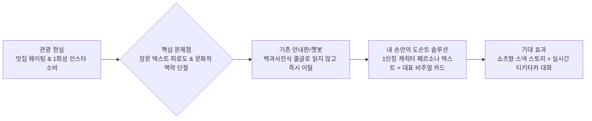
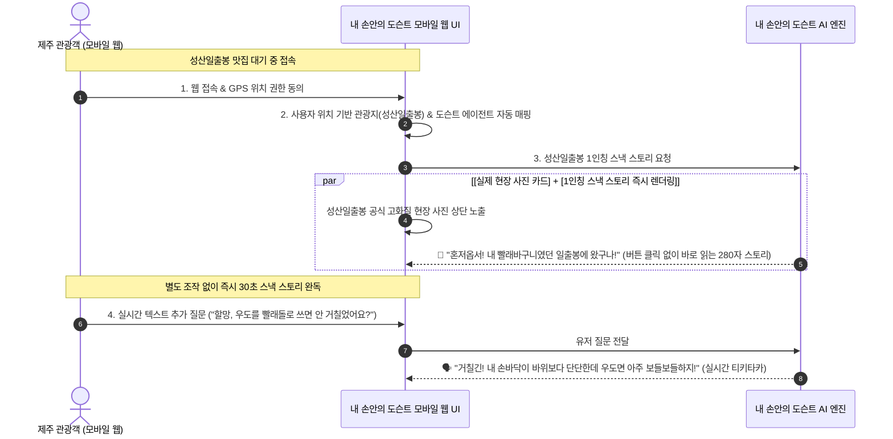
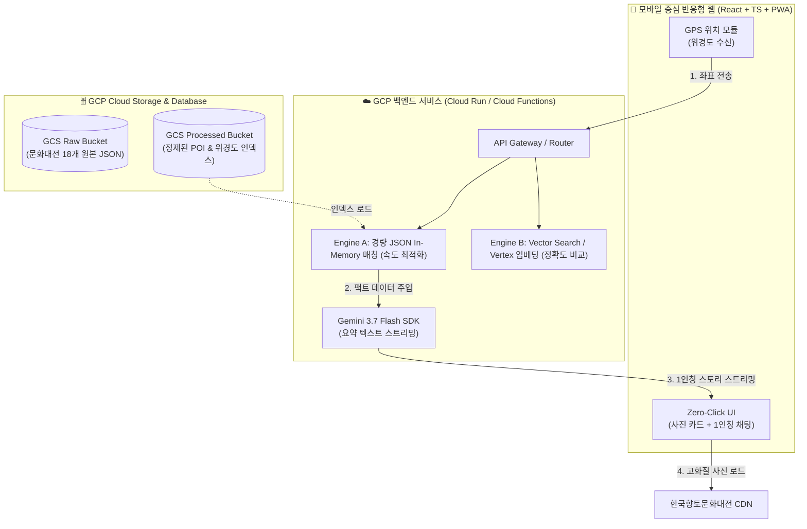
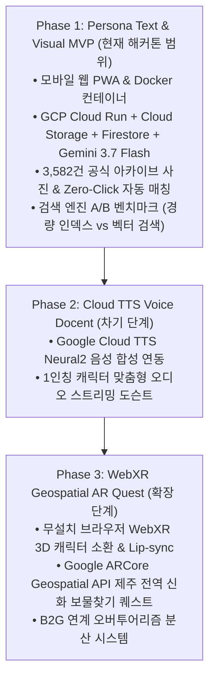

# **[서비스 기획서] 내 손안의 도슨트 (Docent in hand)**

> **"맛집 대기 시간 3분, 1인칭 신화 캐릭터와 나누는 생생한 제주 이야기!"**
> 
> **Google Cloud / Vertex AI 기반 제주 신화·자연 인터랙티브 AI 페르소나 도슨트**

---

## **1. Executive Summary & Problem Framing (서비스 개요 및 기획 배경)**

### **1.1 기획 배경 및 문제 정의**

- **현상 :** 성산일출봉, 산방산, 용두암 등 제주의 상징적 자연·문화 관광지가 단순 햄버거/카페 맛집 방문이나 1회성 인스타그램 사진 촬영 위주의 소비형 관광지로 변질되고 있습니다.
- **핵심 문제 :**
    - **백과사전식 텍스트 피로도:** 기존 문화재 안내판이나 텍스트 챗봇은 딱딱하고 긴 줄글 설명문 위주라  
        관광객이 읽지 않고 즉시 이탈합니다.
    - **문화·자연 맥락 단절:** 맛집과 액티비티 위주의 관광 트렌드로 인해 제주 고유의 화산 지형 생성 비화, 신화·전설, 역사적 가치가 잊혀지고 관광 경험이 피상화되고 있습니다.
- **사용자 인사이트 :** MZ세대는 장문의 설명문을 읽는 대신 웹툰이나 쇼츠처럼 살아있는 캐릭터가 말을 걸어주고, 직관적인 대표 그림을 보며, 가볍게 대화하는 방식을 선호합니다. 특히 맛집 웨이팅 3~5분, 이동 시간 같은 유휴 시간은 몰입도 높은 스낵 콘텐츠를 소비하기에 최적의 골든타임입니다.
- **핵심 질문 (HMW, How Might We?):**_“어떻게 하면 지루한 백과사전식 긴 글 없이도 마치 신화 속 인물과 직접 대화하듯, 제주의 자연과 설화·역사를 쉽고 흥미진진하게 체험하게 만들 수 있을까?”_

---

## **2. 서비스 콘셉트 및 핵심 타깃**

- **서비스명:** 내 손안의 도슨트 (Docent in hand)
- **슬로건:** _"맛집 대기 시간 3분, 1인칭 신화 캐릭터와 나누는 생생한 제주 이야기!"_
- **서비스 형태:** 별도 앱 설치가 필요 없는 **모바일 웹(PWA) 기반 인터랙티브 AI 페르소나 도슨트**
- **핵심 타깃:**
    1. **MZ세대 개별 여행객:** 장문 텍스트를 싫어하고 쇼츠/웹툰형 인터랙티브 콘텐츠를 선호하는 여행자.
    2. **맛집 웨이팅 여행객:** 유명 맛집 및 카페 대기 시간(3~10분) 동안 가볍게 즐길 거리를 찾는 여행자.
    3. **아이 동반 가족 여행객:** 아이에게 지루한 역사 설명 대신 재미있는 옛이야기를 들려주고 싶은 부모.

### **2.1 3대 핵심 사용자 경험**

1. **GPS 기반 관광지 및 전담 캐릭터 자동 매칭 (Zero-Click):** 별도의 복잡한 검색이나 선택 과정 없이, GPS 위치 승인 즉시 최인접 명소와 그 명소에 최적화된 전담 도슨트를 시스템이 자동 배정. *(기획안은 설문대할망·해녀 삼춘·돌하르방 3종 배정이며, 현재 구현은 단일 핵심 요약 에이전트 — 3.1 절 구현 현황 참조)*
2. **공식 아카이브 대표 비주얼 카드 매칭:** 한국학중앙연구원 한국향토문화전자대전의 3,582건 공식 고화질 현장 사진 아카이브를 화면 상단에 즉시 띄워 시각적 현장감과 신뢰도 극대화 (AI 가상 이미지가 아닌 실제 공식 사진 및 출처 표기).
	(한국향토문화전자대전 공식 이미지 출처 표기)
3. **1인칭 스낵 스토리 즉시 렌더링 & 실시간 티키타카:** '이야기 듣기' 버튼을 누를 필요 없이 화면 진입과 동시에 1인칭 구술체 스낵 스토리(250~350자)가 펼쳐지며, 하단 질문창을 통해 캐릭터와 실시간으로 대화를 주고받는 대화형 인터랙션.

---

## **3. 핵심 캐릭터 및 콘텐츠 시나리오**

### **3.1 3대 AI 페르소나 캐릭터 및 데이터 매핑**

> ⚠️ **구현 현황 (2026-08-24 기준)**
> 아래 3대 페르소나는 **기획 단계의 설계안**이다. 현재 코드는 팩트 정확도와 응답
> 일관성을 우선해 **단일 `SummaryAgent`(핵심 요약 에이전트, 📌)로 통합** 운영 중이며,
> 200~300자 팩트 요약을 출력한다. `src/data/characters.ts` 에도 `summaryAgent` 만
> 정의돼 있고, API 의 `characterId` 는 필수값 검증만 남아 있다.
> 상세 구조는 `헤커톤_변경구조_아키택쳐.md` 2장 참조.

1. **설문대할망 (제주 창조의 거대 여신):**
    - **성격:** 호탕하고 웅장하며, 손주를 보듯 여행자를 따뜻하고 유쾌하게 챙겨주는 큰할머니.
    - **어투:** _"혼저옵서! 내가 흙을 치마에 날라 만든 요 섬이 참 곱지 않으냐?"_
    - **특화 장소 및 연계 데이터:** `[자연과 지리]`, `[구비전승]` 카테고리 (성산일출봉, 서귀포 산방산, 한라산 백록담, 만장굴, 용두암 등 거대 자연 지형 및 생성 설화).
2. **해녀 삼춘 (바다와 삶의 수호자):**
    - **성격:** 억척스럽고 정이 넘치며, 제주의 바다 생태계와 해녀 문화를 생생하게 들려주는 로컬 멘토.
    - **어투:** _"어이 손님! 숨비소리 들어봔? 오늘 바당 물결이 아주 곱다게~"_
    - **특화 장소 및 연계 데이터:** `[생활과 민속]`, `[구비전승/언어/문학]` 카테고리 (김녕·협재 해변, 성산 바당, 서귀포 해녀 탈의장, 해녀 노래·물질 도구 등 해양·생활사 POI).
3. **돌하르방 (듬직한 제주의 수호신):**
    - **성격:** 과묵하지만 든든하고, 제주의 역사와 돌문화, 방어 유적을 묵직하게 안내하는 파수꾼.
    - **어투:** _"탐라의 오랜 역사를 지켜온 몸이우다. 이 땅의 깊은 숨결을 전해드리지요."_
    - **특화 장소 및 연계 데이터:** `[문화유산]`, `[역사]`, `[성씨와 인물]` 카테고리 (제주목관아, 삼양동 선사유적, 관덕정, 정의현성 등 역사·문화재 POI).

---

## **4. 사용자 인터랙션 및 서비스 흐름 (Zero-Click 즉시 몰입)**

---

## **5. 도메인 콘텐츠 운영 정책**

1. **방언 황금 비율 원칙 :**
    - 2030 외지인이 이해하기 어려운 고어는 배제하고, 친숙한 종결어미(`수다`, `마씸`)와 쉬운 호칭(`삼춘`, `하르방`, `혼저옵서`) 위주로 20~30%만 자연스럽게 배합.
    - 낯선 단어는 괄호(표준어 풀이)를 병기하여 가독성 보장.
2. **스낵 텍스트 분량 엄격 제한 :**
    - 초기 스토리는 공백 포함 250~350자(모바일 한 화면)로 엄격히 제한하여 스크롤 압박 없이 30초 내에 완독 유도.
    - [도입(시선 유도) ➔ 절정(신화 탄생 비화) ➔ 질문(유저 대화 유도)] 3단 구성.
3. **100% 팩트 그라운딩 및 아카이브 사진 연동:**
    - **공인 원천 데이터:** 한국학중앙연구원 **한국향토문화전자대전**(디지털제주시문화대전 2,755건 + 디지털서귀포문화대전 2,406건 = 총 5,161건)의 정밀 학술·설화 텍스트 및 **3,582건의 공식 현장 사진 아카이브**에 100% 기반하여 서술.
    - **할루시네이션 및 역사 왜곡 방지:** 검색 증강(RAG) / Grounded Generation을 통해 공인된 지리적·역사적 사실만 캐릭터의 입을 빌려 전달하며, 허위 질문 유입 시 페르소나 어투로 유쾌하고 명확하게 정정.

---

## **6. 비즈니스 모델 및 사회적 가치**

1. **B2B 웨이팅 솔루션 연동 (식당/카페 제휴):**
    - 캐치테이블, 테이블링 등 유명 식당 웨이팅 시스템과 연계하여 대기 등록 시 "대기 시간 5분 동안 즐기는 성산일출봉 신화 이야기" 링크 제공.
2. **B2G 스마트 관광 인프라 (지자체/제주관광공사 연계):**
    - 특정 유명 관광지(성산일출봉 등)에 과밀된 인파를 주변 오름과 숨은 로컬 마을의 신화 명소로 분산시키는 오버투어리즘 완화 솔루션.
3. **ESG 소셜 임팩트 (무형문화유산 보존):**
    - 소멸 위기인 제주 방언과 1,800 신화 구술 자료를 생성형 AI 인터랙티브 콘텐츠로 재해석하여 젊은 세대에 자연스럽게 전승.

---

## **7. 기술 아키텍처 및 구현 스택 (Tech Stack & Architecture)**

### **7.1 시스템 아키텍처**

### **7.2 기술 스택 요약**
- **Frontend:** React 18, TypeScript, Vite, PWA, CSS Modules (Docker 멀티스테이지 컨테이너 빌드 & Firebase Hosting)
- **Backend:** Python (FastAPI) / Node.js (GCP Cloud Functions / Cloud Run 컨테이너)
- **Storage & Cloud:** Google Cloud Storage (GCS 버킷 데이터 파이프라인)
- **AI & RAG:** Google Gemini 3.7 Flash (2-Layer 에이전트: 리서치 → 핵심 요약 생성)
- **Data Benchmark:** Engine A(경량 인덱스 매칭, ~20ms) vs Engine B(벡터 검색, ~300ms) 성능/지연시간 실시간 A/B 벤치마크

---

## **8. 미래 로드맵 (Future Roadmap)**

- **Phase 1 (해커톤 MVP):** 모바일 웹 PWA 기반 Zero-Click 페르소나 텍스트 + 공식 아카이브 사진 + 실시간 Q&A 티키타카 + GCP 버킷/백엔드 A/B 엔진 구축.
- **Phase 2 (차기 로드맵):** Google Cloud TTS Neural2 기반 1인칭 오디오 보이스 도슨트 스트리밍 추가.
- **Phase 3 (확장 로드맵):** 무설치 브라우저 WebXR 기반 3D 신화 캐릭터 공간 증강현실(AR) 소환 및 Google Geospatial API 신화 보물찾기 퀘스트.
