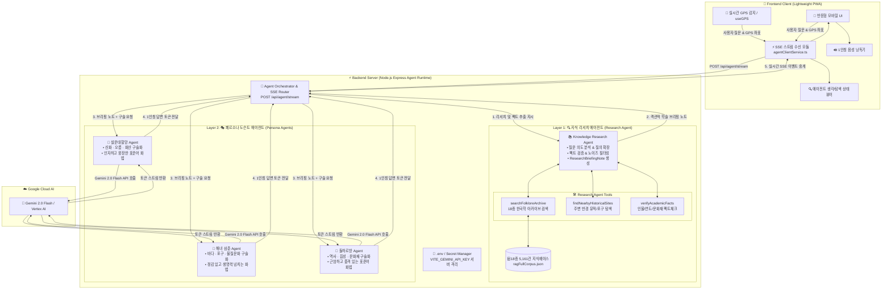

# 🏛️ [해커톤] 변경 구조 아키텍처 명세서 (Multi-Agent Architecture)

본 문서는 **Docent-in-Hand (내 손안의 제주 도슨트)**의 차세대 **백엔드 기반 2-Layer 멀티 에이전트(Multi-Agent) 분업 아키텍처**를 상세히 정의하고 명세합니다.

---

## 1. 📊 변경 아키텍처 개요 및 전체 다이어그램

기존의 프론트엔드 단독 구조에서 탈피하여, **지식 탐색/검증(Research Agent)**과 **1인칭 구술 스토리텔링(Persona Docent Agents)**을 분리하고, 모든 AI 로직 및 데이터베이스를 **백엔드 서버(Node.js/Express)에서 안전하게 오케스트레이션**하는 2-Layer 멀티 에이전트 구조로 전환합니다.



---

## 2. 🧩 2-Layer 에이전트별 세부 역할 명세

```
[관광객 질문/장소 인입]
         │
         ▼
┌─────────────────────────────────────────────────────────────┐
│ 🔍 [Layer 1] 지식 리서치 에이전트 (Knowledge Research Agent) │
│ • 페르소나 없음 (엄격한 학술 연구원 / Fact Finder)          │
│ • 18종 5,161건 한국학 아카이브 검색 & 팩트 검증             │
│ • 출력: 객관적 학술 브리핑 노트 (ResearchBriefingNote)      │
└─────────────────────────────────────────────────────────────┘
         │
         ▼ (검증된 학술 브리핑 노트 전달)
┌─────────────────────────────────────────────────────────────┐
│ 🎭 [Layer 2] 페르소나 도슨트 에이전트 (Persona Docent Agents)│
│ ┌─────────────────────────────────────────────────────────┐ │
│ │ 👵 설문대할망 Agent : 인자하고 거대한 창조신 (신화·자연)│ │
│ │ 🤿 해녀 삼춘 Agent   : 삶의 지혜를 전하는 베테랑 해녀 (바다)│
│ │ 🗿 돌하르방 Agent   : 수백 년 읍성을 지킨 근엄한 수호신 (역사)│
│ └─────────────────────────────────────────────────────────┘ │
└─────────────────────────────────────────────────────────────┘
         │
         ▼
[🎙️ 100% 자연스러운 표준어 1인칭 입체 도슨트 답변]
```

### 1️⃣ Layer 1: 지식 리서치 에이전트 (`Knowledge Research Agent`)
- **목표**: 감정이나 연기를 철저히 배제하고, 질문 및 장소와 관련된 **공인 설화 원문, 역사 인물, 지질 팩트, 민속 기록을 발굴 및 교차 검증**.
- **동작 특징**:
  - `searchFolkloreArchive`, `findNearbyHistoricalSites`, `verifyAcademicFacts` 전용 Tools를 활용.
  - 환각(Hallucination)이 없는 구조화된 **`ResearchBriefingNote`**를 생성하여 Layer 2에 전달.

---

### 2️⃣ Layer 2: 3대 페르소나 도슨트 에이전트 (`Persona Docent Agents`)
- **목표**: 리서치 에이전트가 검증한 팩트 노트를 바탕으로 각 캐릭터 고유의 세계관에 맞추어 **100% 매끄러운 표준어 1인칭 스토리텔링** 수행.
- **3대 독립 에이전트**:
  1. **👵 설문대할망 Agent**: 태고의 제주를 빚어낸 거대한 어머니 여신 (신화, 오름, 화산 지형 해설).
  2. **🤿 해녀 삼춘 Agent**: 바다와 파도를 이겨낸 베테랑 해녀 (바당, 해수욕장, 포구, 물질 문화 해설).
  3. **🗿 돌하르방 Agent**: 수백 년 제주 읍성을 지켜온 근엄하고 지혜로운 수호신 (역사, 읍성, 문화재, 호국 항쟁 해설).

---

## 3. 🔌 백엔드 API & SSE 스트리밍 통신 규격

### 엔드포인트: `POST /api/agent/stream`

#### 1. 요청 (Request Body)
```json
{
  "poiId": "GC00700266",
  "poiName": "제주목관아 & 관덕정",
  "characterId": "dolhareubang",
  "userMessage": "관덕정 편액 글씨와 창건 배경이 궁금해요",
  "coordinates": { "lat": 33.5134, "lng": 126.5218 }
}
```

#### 2. SSE 응답 이벤트 흐름 (Response Events)
```http
HTTP/1.1 200 OK
Content-Type: text/event-stream
Cache-Control: no-cache
Connection: keep-alive

event: agent_status
data: {"step": "researching", "message": "🔍 18종 한국학 아카이브에서 관덕정 편액 및 창건 인물(신숙청) 탐색 중..."}

event: research_complete
data: {"sources": ["한국향토문화전자대전 - 관덕정", "신숙청 목사"], "factCount": 4}

event: persona_stream
data: {"token": "허허, ", "character": "dolhareubang"}

event: persona_stream
data: {"token": "탐라의 유구한 역사를 찾아오셨구려. ", "character": "dolhareubang"}

event: done
data: {"totalLatencyMs": 850, "references": ["한국향토문화전자대전 - 관덕정"]}
```

---

## 4. 📁 프로젝트 디렉토리 구조

```
Docent-in-hand/
├── server/                         # ⚡ [백엔드] 멀티 에이전트 런타임 서버
│   ├── src/
│   │   ├── index.ts                # Express/Fastify 서버 진입점 (SSE 핸들러)
│   │   ├── config/env.ts           # GEMINI_API_KEY 서버 격리 환경변수
│   │   ├── agents/
│   │   │   ├── orchestrator.ts     # 2-Layer 에이전트 파이프라인 조율기
│   │   │   ├── researchAgent.ts    # Layer 1: 자료 탐색 & 팩트 브리핑 에이전트
│   │   │   ├── personaAgents/      # Layer 2: 3대 도슨트 에이전트
│   │   │   │   ├── seolmundaeAgent.ts
│   │   │   │   ├── haenyeoAgent.ts
│   │   │   │   └── dolhareubangAgent.ts
│   │   │   └── tools/              # 리서치 에이전트 전용 Tools
│   │   └── data/
│   │       └── ragFullCorpus.json  # 서버사이드 18종 3,285건 지식베이스
│   ├── package.json
│   └── tsconfig.json
│
├── src/                            # 📱 [프론트엔드] 초경량 UI & 인터랙션 클라이언트
│   ├── services/
│   │   └── agentClientService.ts   # 백엔드 SSE 스트림 수신 및 상태 관리
│   ├── components/                 # UI 컴포넌트 (StoryCard, ChatSection, Map 등)
│   └── hooks/                      # useGPS, useAudioPlayer
```

---

## 5. 🌟 기존 구조 대비 핵심 개선 효과

| 비교 항목 | 기존 구조 (Legacy) | 변경된 멀티 에이전트 구조 (New) | 개선 효과 |
|:---|:---|:---|:---|
| **보안 (Security)** | API Key 브라우저 노출 | 백엔드 서버에서 완벽 격리 | 🔒 **API 키 탈취 위험 원천 차단** |
| **번들 크기 & 속도** | 프론트엔드에 9.8MB DB 적재 | 백엔드 서버에만 적재 (클라이언트 경량화) | ⚡ **초기 웹 앱 로딩 속도 5배 향상** |
| **답변 신뢰도 (Fact)** | 단일 LLM이 지식검색+연기 동시 수행 (환각 위험) | **리서치 에이전트의 팩트 검증 후 연기** | 🎯 **거짓 정보(Hallucination) 원천 방지** |
| **페르소나 몰입도** | 프롬프트 길이에 따라 어투 붕괴 | 검증된 팩트 노트 기반 1인칭 화법 전념 | 🎭 **자연스러운 표준어 도슨트 구술 완성** |
| **복합 질문 대응력** | 정해진 1회성 RAG 검색만 가능 | **자율 도구 호출(Tool Use) 기반 ReAct** | 🧠 **주변 연계 코스 등 복합 질문 자율 해결** |
