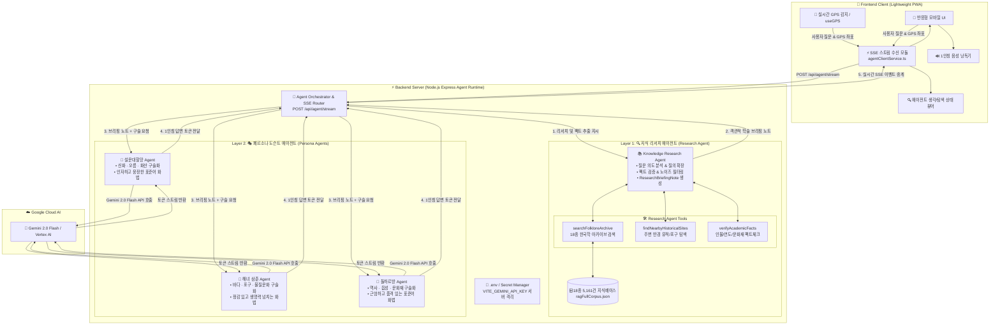
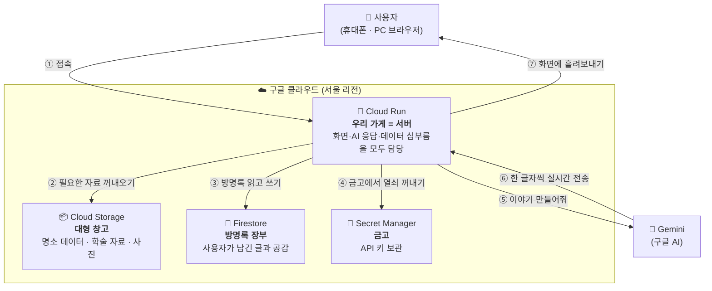
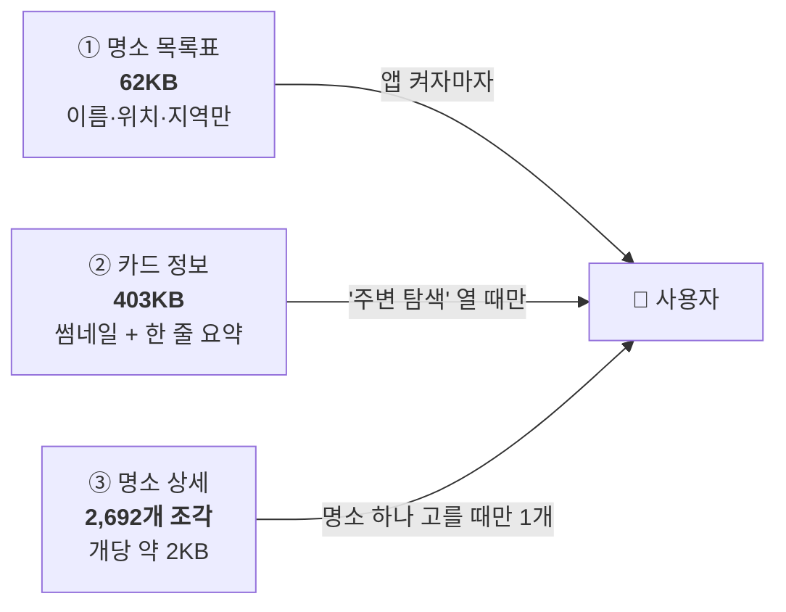
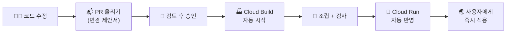

# 🏛️ [해커톤] 변경 구조 아키텍처 명세서 (Multi-Agent Architecture)

본 문서는 **Docent-in-Hand (내 손안의 제주 도슨트)**의 차세대 **백엔드 기반 2-Layer 멀티 에이전트(Multi-Agent) 분업 아키텍처**를 상세히 정의하고 명세합니다.

---

## 1. 📊 변경 아키텍처 개요 및 전체 다이어그램

기존의 프론트엔드 단독 구조에서 탈피하여, **지식 탐색/검증(Research Agent)**과 **1인칭 구술 스토리텔링(Persona Docent Agents)**을 분리하고, 모든 AI 로직 및 데이터베이스를 **백엔드 서버(Node.js/Express)에서 안전하게 오케스트레이션**하는 2-Layer 멀티 에이전트 구조로 전환합니다.



---

## 2. 🧩 2-Layer 에이전트별 세부 역할 명세

```
[관광객 질문/장소 인입]
         │
         ▼
┌─────────────────────────────────────────────────────────────┐
│ 🔍 [Layer 1] 지식 리서치 에이전트 (Knowledge Research Agent) │
│ • 페르소나 없음 (엄격한 학술 연구원 / Fact Finder)          │
│ • 18종 5,161건 한국학 아카이브 검색 & 팩트 검증             │
│ • 출력: 객관적 학술 브리핑 노트 (ResearchBriefingNote)      │
└─────────────────────────────────────────────────────────────┘
         │
         ▼ (검증된 학술 브리핑 노트 전달)
┌─────────────────────────────────────────────────────────────┐
│ 🎭 [Layer 2] 페르소나 도슨트 에이전트 (Persona Docent Agents)│
│ ┌─────────────────────────────────────────────────────────┐ │
│ │ 👵 설문대할망 Agent : 인자하고 거대한 창조신 (신화·자연)│ │
│ │ 🤿 해녀 삼춘 Agent   : 삶의 지혜를 전하는 베테랑 해녀 (바다)│
│ │ 🗿 돌하르방 Agent   : 수백 년 읍성을 지킨 근엄한 수호신 (역사)│
│ └─────────────────────────────────────────────────────────┘ │
└─────────────────────────────────────────────────────────────┘
         │
         ▼
[🎙️ 100% 자연스러운 표준어 1인칭 입체 도슨트 답변]
```

### 1️⃣ Layer 1: 지식 리서치 에이전트 (`Knowledge Research Agent`)
- **목표**: 감정이나 연기를 철저히 배제하고, 질문 및 장소와 관련된 **공인 설화 원문, 역사 인물, 지질 팩트, 민속 기록을 발굴 및 교차 검증**.
- **동작 특징**:
  - `searchFolkloreArchive`, `findNearbyHistoricalSites`, `verifyAcademicFacts` 전용 Tools를 활용.
  - 환각(Hallucination)이 없는 구조화된 **`ResearchBriefingNote`**를 생성하여 Layer 2에 전달.

---

### 2️⃣ Layer 2: 3대 페르소나 도슨트 에이전트 (`Persona Docent Agents`)
- **목표**: 리서치 에이전트가 검증한 팩트 노트를 바탕으로 각 캐릭터 고유의 세계관에 맞추어 **100% 매끄러운 표준어 1인칭 스토리텔링** 수행.
- **3대 독립 에이전트**:
  1. **👵 설문대할망 Agent**: 태고의 제주를 빚어낸 거대한 어머니 여신 (신화, 오름, 화산 지형 해설).
  2. **🤿 해녀 삼춘 Agent**: 바다와 파도를 이겨낸 베테랑 해녀 (바당, 해수욕장, 포구, 물질 문화 해설).
  3. **🗿 돌하르방 Agent**: 수백 년 제주 읍성을 지켜온 근엄하고 지혜로운 수호신 (역사, 읍성, 문화재, 호국 항쟁 해설).

---

## 3. 🔌 백엔드 API & SSE 스트리밍 통신 규격

### 엔드포인트: `POST /api/agent/stream`

#### 1. 요청 (Request Body)
```json
{
  "poiId": "GC00700266",
  "poiName": "제주목관아 & 관덕정",
  "characterId": "dolhareubang",
  "userMessage": "관덕정 편액 글씨와 창건 배경이 궁금해요",
  "coordinates": { "lat": 33.5134, "lng": 126.5218 }
}
```

#### 2. SSE 응답 이벤트 흐름 (Response Events)
```http
HTTP/1.1 200 OK
Content-Type: text/event-stream
Cache-Control: no-cache
Connection: keep-alive

event: agent_status
data: {"step": "researching", "message": "🔍 18종 한국학 아카이브에서 관덕정 편액 및 창건 인물(신숙청) 탐색 중..."}

event: research_complete
data: {"sources": ["한국향토문화전자대전 - 관덕정", "신숙청 목사"], "factCount": 4}

event: persona_stream
data: {"token": "허허, ", "character": "dolhareubang"}

event: persona_stream
data: {"token": "탐라의 유구한 역사를 찾아오셨구려. ", "character": "dolhareubang"}

event: done
data: {"totalLatencyMs": 850, "references": ["한국향토문화전자대전 - 관덕정"]}
```

---

## 4. 📁 프로젝트 디렉토리 구조

```
Docent-in-hand/
├── server/                         # ⚡ [백엔드] 멀티 에이전트 런타임 서버
│   ├── src/
│   │   ├── index.ts                # Express/Fastify 서버 진입점 (SSE 핸들러)
│   │   ├── config/env.ts           # GEMINI_API_KEY 서버 격리 환경변수
│   │   ├── agents/
│   │   │   ├── orchestrator.ts     # 2-Layer 에이전트 파이프라인 조율기
│   │   │   ├── researchAgent.ts    # Layer 1: 자료 탐색 & 팩트 브리핑 에이전트
│   │   │   ├── personaAgents/      # Layer 2: 3대 도슨트 에이전트
│   │   │   │   ├── seolmundaeAgent.ts
│   │   │   │   ├── haenyeoAgent.ts
│   │   │   │   └── dolhareubangAgent.ts
│   │   │   └── tools/              # 리서치 에이전트 전용 Tools
│   │   └── data/
│   │       └── ragFullCorpus.json  # 서버사이드 18종 3,285건 지식베이스
│   ├── package.json
│   └── tsconfig.json
│
├── src/                            # 📱 [프론트엔드] 초경량 UI & 인터랙션 클라이언트
│   ├── services/
│   │   └── agentClientService.ts   # 백엔드 SSE 스트림 수신 및 상태 관리
│   ├── components/                 # UI 컴포넌트 (StoryCard, ChatSection, Map 등)
│   └── hooks/                      # useGPS, useAudioPlayer
```

---

## 5. 🌟 기존 구조 대비 핵심 개선 효과

| 비교 항목 | 기존 구조 (Legacy) | 변경된 멀티 에이전트 구조 (New) | 개선 효과 |
|:---|:---|:---|:---|
| **보안 (Security)** | API Key 브라우저 노출 | 백엔드 서버에서 완벽 격리 | 🔒 **API 키 탈취 위험 원천 차단** |
| **번들 크기 & 속도** | 프론트엔드에 9.8MB DB 적재 | 백엔드 서버에만 적재 (클라이언트 경량화) | ⚡ **초기 웹 앱 로딩 속도 5배 향상** |
| **답변 신뢰도 (Fact)** | 단일 LLM이 지식검색+연기 동시 수행 (환각 위험) | **리서치 에이전트의 팩트 검증 후 연기** | 🎯 **거짓 정보(Hallucination) 원천 방지** |
| **페르소나 몰입도** | 프롬프트 길이에 따라 어투 붕괴 | 검증된 팩트 노트 기반 1인칭 화법 전념 | 🎭 **자연스러운 표준어 도슨트 구술 완성** |
| **복합 질문 대응력** | 정해진 1회성 RAG 검색만 가능 | **자율 도구 호출(Tool Use) 기반 ReAct** | 🧠 **주변 연계 코스 등 복합 질문 자율 해결** |

---

# 🚀 Part 2. 클라우드 배포 아키텍처 & CI/CD (비전공자용 설명)

> Part 1이 **"AI가 어떻게 이야기를 만드는가"** 였다면, Part 2는 **"그 프로그램이 어떻게 인터넷에 올라가서 모두가 쓸 수 있게 되는가"** 를 다룹니다.
> 전공 지식 없이 읽을 수 있도록, 용어가 나올 때마다 일상적인 비유로 함께 설명합니다.

---

## 6. 🏗️ 전체 그림 — 우리 서비스는 어디에 살고 있나

### 한 줄 요약

> **구글 클라우드(GCP)라는 남의 건물에 우리 가게를 세 들어 운영하고 있습니다.**
> 손님이 오면 점원 한 명이 안내·주문·창고 심부름을 전부 처리합니다.



### 등장인물 소개

| 이름 | 정체 | 일상 비유 |
|:---|:---|:---|
| **Cloud Run** | 우리가 만든 프로그램이 실제로 돌아가는 곳 | **가게**. 손님이 없으면 문을 닫고(비용 0), 몰리면 점원을 자동으로 늘립니다 |
| **Cloud Storage (GCS)** | 큰 파일을 보관하는 창고 | **창고**. 물건은 많은데 자주 안 꺼내는 것들을 보관 |
| **Firestore** | 계속 바뀌는 기록을 저장하는 곳 | **방명록 장부**. 여러 명이 동시에 써도 안 엉킴 |
| **Secret Manager** | 비밀번호·API 키 보관소 | **금고**. 코드에 비밀번호를 적어두지 않기 위함 |
| **Cloud Build** | 코드를 프로그램으로 만들어 배포하는 자동 기계 | **공장 컨베이어 벨트** |

### 왜 "가게 하나"에 다 몰아넣었나

프론트엔드(화면)와 백엔드(두뇌)를 **따로 배포하는 방식도 있지만 일부러 합쳤습니다.**

- 따로 두면 화면과 두뇌가 서로 **다른 주소**에 살게 되어, 브라우저가 "너희 둘 진짜 한 팀 맞아?"라고 매번 확인하는 절차(CORS)가 필요합니다.
- 특히 우리 서비스는 AI 답변을 **한 글자씩 실시간으로 흘려보내는데**(SSE), 중간에 다른 서버가 끼면 글자를 모아뒀다가 한 번에 보내버려 **"타자 치는 느낌"이 사라집니다.**
- 한 주소에 두면 이 문제가 아예 생기지 않습니다.

---

## 7. 📦 데이터를 왜 창고로 옮겼나 — 40MB → 212KB 이야기

### 문제 상황

처음에는 제주 명소 데이터 전체를 **웹사이트 파일 안에 그대로 넣어**뒀습니다.

> 📕 **비유:** 식당에 갔는데, 메뉴판을 달라고 하니 **백과사전 40권을 통째로** 들고 오는 상황입니다.
> 손님은 오늘의 메뉴 한 줄만 보고 싶은데, 백과사전이 다 도착할 때까지 기다려야 합니다.

숫자로 보면 이렇습니다.

| | 용량 | 휴대폰에서 |
|:---|---:|:---|
| 예전 (전부 한 덩어리) | **7.7MB** | LTE에서 수십 초, 데이터 요금도 부담 |
| 지금 | **212KB** | 거의 즉시 |

**36배 줄었습니다.**

### 해결 방법 — 3단계로 쪼개기

메뉴판을 목적에 맞게 나눴습니다.



| 단계 | 비유 | 언제 가져오나 |
|:---|:---|:---|
| ① 목록표 (62KB) | **메뉴 이름만 적힌 한 장짜리 목록** | 앱 켜는 순간 |
| ② 카드 (403KB) | **사진과 한 줄 설명이 붙은 메뉴판** | 명소 목록을 열어볼 때 |
| ③ 상세 (2KB×2,692) | **그 요리 하나의 상세 레시피** | 명소를 실제로 선택할 때 |

핵심은 **"지금 당장 필요한 것만 가져온다"** 입니다.
명소 2,692곳의 상세 정보를 미리 다 받을 이유가 없습니다. 사용자는 한 번에 한 곳만 보니까요.

### 왜 이렇게까지 나눴나 — 실제 조사 결과

명소 데이터를 항목별로 뜯어보니, **`mythAndFact`(설화 본문) 하나가 전체 9.3MB 중 5.8MB**를 차지하고 있었습니다.
목록에 이름을 띄우는 데는 전혀 필요 없는 정보였습니다.

> 📕 **비유:** 전화번호부에서 이름·번호만 있으면 되는데, 사람마다 자서전이 통째로 붙어 있던 셈입니다.

---

## 8. 🔒 보안 — 열쇠는 금고에, 창고 문은 잠가서

### 세 종류의 열쇠를 다르게 취급합니다

| 열쇠 | 어디에 쓰나 | 어떻게 보관 | 왜 |
|:---|:---|:---|:---|
| **Gemini API 키** | AI에게 이야기를 요청할 때 | 🔐 금고(Secret Manager) → **서버만** 사용 | 유출되면 **남이 우리 요금으로** AI를 씁니다 |
| **관리자 토큰** | 방명록 전체 삭제할 때 | 🔐 금고 → 서버만 확인 | 없으면 **아무나 방명록을 날릴 수** 있습니다 |
| **카카오맵 키** | 지도를 화면에 그릴 때 | 🔐 금고 → 다만 **화면 파일에는 들어감** | 뒤 설명 참조 |

### 카카오맵 키만 예외인 이유

지도는 **사용자 브라우저가 직접** 카카오 서버에 요청해서 그립니다. 그래서 키가 화면 파일 안에 들어갈 수밖에 없습니다 — **숨길 방법이 원리적으로 없습니다.**

대신 카카오는 다른 방식으로 보호합니다.

> 📕 **비유:** 아파트 공동현관 비밀번호는 주민 모두가 압니다. 대신 **"이 단지 주민만 쓸 수 있게"** 등록된 사람만 통과시킵니다.
> 카카오맵도 **"우리 서비스 주소에서 온 요청만 허용"** 으로 설정해 뒀습니다.

실제로 확인한 결과입니다.

```
우리 주소로 요청     → ✅ 정상 동작
다른 주소로 요청     → ❌ AccessDeniedError: domain mismatched!
```

### 창고(GCS) 문은 잠가뒀습니다

명소 데이터 창고는 **인터넷에 공개하지 않았습니다.** 브라우저가 창고에 직접 가는 게 아니라, **가게 점원(서버)이 대신 다녀옵니다.**

```
브라우저 → 우리 서버 → (직원 신분증으로 인증) → 창고
```

창고 주소를 직접 입력하면 `403 Forbidden`(접근 거부)이 뜹니다.

---

## 9. 📒 방명록은 왜 따로 Firestore를 쓰나

### 처음 방식의 문제

방명록 글을 **서버 안의 파일**에 저장하려 했는데, 이러면 동작하지 않습니다.

> 📕 **비유:** 손님이 몰리면 가게가 점원을 자동으로 최대 5명까지 늘립니다.
> 그런데 **점원마다 자기 수첩에** 방명록을 적으면?
> - 1번 점원이 받은 글을 4번 점원은 모릅니다 → **다른 사용자에게 안 보임**
> - 퇴근하면 수첩을 버립니다 → **글이 사라짐** (서버 재시작 시 초기화)

또 하나, **공감(♥) 숫자**도 문제였습니다.

> 두 사람이 동시에 공감을 누르면, 둘 다 "지금 10개네 → 11개로 바꿔야지"라고 읽고 각자 11을 씁니다.
> **결과는 12가 아니라 11.** 하나가 사라집니다.

### Firestore로 해결

Firestore는 **모두가 같이 쓰는 공용 장부**입니다. 점원이 몇 명이든 같은 장부를 봅니다.
공감 숫자도 `+1 해줘`라고 장부에 맡기면 장부가 알아서 순서를 정리합니다.

**실제 검증 결과:**

```
공감 +1 요청 10개를 동시에 발사  →  결과: 정확히 10  ✅ (하나도 안 사라짐)
글 작성 후 20번 조회             →  20번 모두 동일하게 조회됨  ✅
```

### 사진은 왜 창고로 보내나

방명록에 사진을 붙이면, 그 사진을 장부에 그대로 붙여 넣을 수 없습니다.

> 📕 **비유:** 장부 한 칸에는 A4 한 장 분량만 들어갑니다(1MB 제한).
> 그런데 휴대폰 사진은 3~5MB입니다. **칸에 안 들어갑니다.**

그래서 이렇게 처리합니다.

```
① 브라우저가 사진을 적당한 크기로 줄임 (긴 변 1280px, 보통 300KB)
② 서버가 사진을 창고에 보관
③ 장부에는 "창고 몇 번 선반" 이라는 위치만 적음
```

---

## 10. 🔄 CI/CD — 코드가 저절로 서비스가 되는 컨베이어 벨트

### CI/CD가 뭔가요

**"코드를 고쳐서 승인하면, 사람이 아무것도 안 해도 자동으로 인터넷에 반영되는 장치"** 입니다.

- **CI** (Continuous Integration, 지속적 통합): 코드가 문제없이 조립되는지 **자동 검사**
- **CD** (Continuous Deployment, 지속적 배포): 검사를 통과하면 **자동으로 서비스에 반영**

### 예전에는 어땠나

```
개발자가 자기 노트북에서 명령어를 직접 입력 → 배포
```

문제가 있었습니다.

- 누구 노트북에서 언제 올린 건지 **기록이 안 남습니다**
- 실수로 **아직 안 끝난 코드**를 올릴 수 있습니다
- 지금 서비스 중인 게 **어떤 버전인지 알 수 없습니다**

### 지금은 이렇게 됩니다



**사람이 하는 일은 '승인' 버튼 누르기 하나뿐입니다.** 나머지 약 2~3분은 전부 자동입니다.

### 어떤 버전이 서비스 중인지 이름만 봐도 압니다

배포될 때마다 **코드 변경 기록의 고유 번호**를 이름에 새깁니다.

```
docent-in-hand-ae422f8
                ~~~~~~~
                이 7자리가 "몇 번째 수정본인지" 알려주는 지문
```

> 📕 **비유:** 책의 **인쇄 쇄수**와 같습니다. "3쇄"라고 적혀 있으면 어느 판본인지 바로 압니다.

### 자동 검사가 실제로 사고를 막은 사례

CI가 없었다면 그냥 넘어갔을 문제들이 실제로 잡혔습니다. (자세한 내용은 `헤커톤_트러블슈팅.md` TS-012 ~ TS-019)

| 사례 | 무슨 일이 있었나 |
|:---|:---|
| **파일이 안 올라감** | 설정 파일에 `data`라고만 적었더니, 의도한 폴더 말고 **비슷한 이름의 다른 폴더까지** 함께 빠져서 조립 실패 |
| **없어진 AI 모델** | 사용 중이던 AI 모델이 **서비스 종료**돼 답변 생성 실패. 개발자 컴퓨터에서는 최신 설정이라 몰랐음 |
| **압축 누락** | 화면 파일을 압축 없이 보내 **606KB → 137KB로 줄일 걸** 그냥 보내고 있었음 |
| **지도 열쇠 누락** | 지도 키가 조립 단계에서 안 들어가 **빌드는 성공인데 지도만 안 뜨는** 상태 |

---

## 11. ⚠️ 이 프로젝트에서 배운 가장 중요한 함정

### "제 컴퓨터에서는 되는데요?"

**같은 문제가 3번 반복됐습니다.** 이 프로젝트에서 가장 값진 교훈입니다.

> 📕 **비유:** 요리사가 **자기 주방에 이미 꺼내둔 재료**로 요리하면 잘 됩니다.
> 그런데 새 주방(자동 공장)에는 **그 재료가 없습니다.**
> 재료를 "필요할 때 창고에서 꺼내온다"고 바꿨는데, 새 코드를 쓸 때마다 습관적으로 **다시 "주방에 있는 재료"를 쓰도록** 적어버린 겁니다.

구체적으로는, 명소 데이터 파일이 **자동으로 만들어지는 파일**이라 코드 저장소에는 없습니다.
개발자 컴퓨터에는 남아 있어서 **로컬에서는 정상**이지만, 자동 공장은 저장소만 받아오므로 **파일이 없어 조립 실패**합니다.

**대응 방법:** 배포 전에 항상 **"재료를 치운 상태"를 흉내 내서** 검사합니다.

```
생성 파일을 잠시 옆으로 치움 → 조립 검사 → 통과하면 안전 → 파일 복구
```

이 절차로 3번째 사고를 **머지 직전에** 잡아냈습니다.

---

## 12. 💰 운영 비용 — 얼마나 드나

| 항목 | 월 비용 | 설명 |
|:---|---:|:---|
| Cloud Run (가게) | **$15~25** | 손님이 없어도 점원 1명 대기 중이라 발생 |
| Cloud Storage (창고) | ~$0.002 | 10MB라 사실상 0원 |
| Firestore (장부) | $0 | 무료 사용량 안에서 해결 |
| Cloud Build (공장) | $0 | 월 2,500분 무료, 우리는 몇 분 수준 |
| Secret Manager (금고) | ~$0.06 | |
| **합계** | **약 $20** | |

**비용의 95% 이상이 "점원 1명 상시 대기"** 때문입니다.
시연이 끝나면 이 대기를 끄면 **월 $1 미만**이 됩니다. 대신 첫 손님이 3~5초 기다려야 합니다(가게 문 여는 시간).

---

## 13. 📋 현재 운영 현황 요약

| 항목 | 값 |
|:---|:---|
| 서비스 주소 | `https://docent-in-hand-660438036743.asia-northeast3.run.app` |
| 서버 위치 | 구글 클라우드 **서울** 리전 |
| 서버 사양 | 메모리 2GB · CPU 2개 · 동시 접속 40명/점원 · 점원 1~5명 |
| 학술 자료 | 5,161건 |
| 명소 데이터 | 2,692곳 |
| 방명록 | Firestore 저장, 실시간 공유 |
| 초기 로딩 | 212KB |
| 배포 방식 | PR 승인 시 자동 (약 2~3분) |

